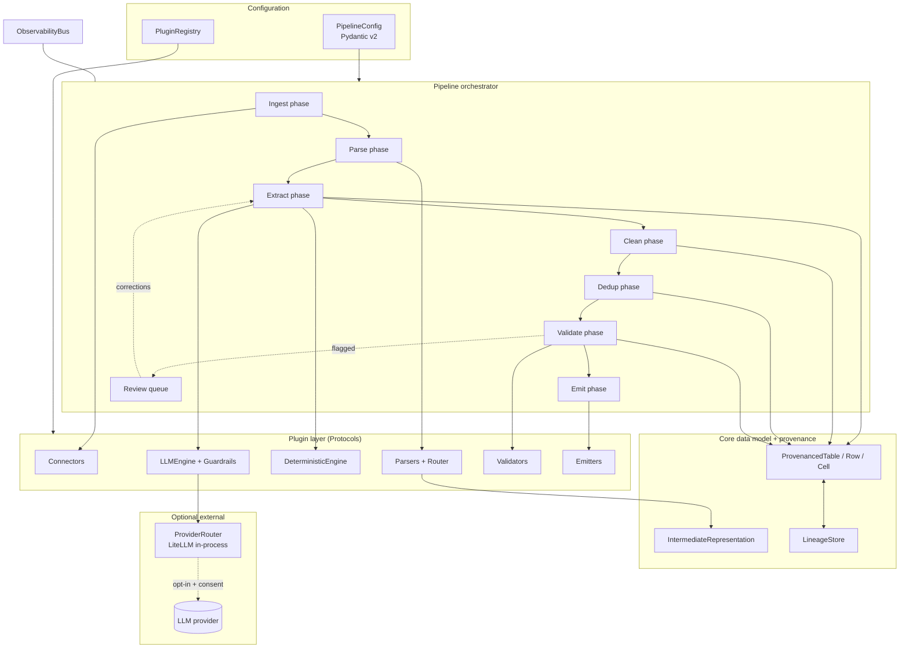

# Design Document

## Overview

This document specifies the design of **Layer 1 of Locus: the processing engine** — a pip-installable Python library that turns a mixed, unstructured corpus into validated, source-grounded tabular data. It is consumed by, but independent of, the Layer 2 runtime (`locus-image-runtime`); an image embeds this engine.

The design leads with the **core data model**, because every component binds to it and because the engine's differentiator — cell-level provenance and faithfulness that survive transformation — is a property of these data structures, not of any single component. Provenance is framework-managed: the SDK's data types carry and compose lineage automatically, so a plugin author must deliberately break lineage rather than remember to add it.

### Tech baseline (locked)

- **Python 3.11+**
- **Packaging:** `uv` + `pyproject.toml`
- **Data model / validation:** Pydantic v2
- **Tabular payload:** Apache Arrow / pandas (Parquet on disk)
- **LLM routing:** LiteLLM Python SDK (in-process), wrapped by Instructor-style schema enforcement
- **Optional LLM:** off by default; activated only by a local credential presence check

### Design principles

1. **Provenance is intrinsic.** A `Cell` is never a bare value; it is value + identity + lineage + faithfulness + source location.
2. **Deterministic-first, LLM-bounded.** Deterministic Python does structural work; the LLM is a constrained, optional component restricted to fuzzy field-mapping.
3. **Everything is a plugin.** Connectors, Parsers, Extractors, Validators, and Emitters are swappable behind stable interfaces.
4. **Stable, versioned contracts.** The Intermediate Representation (Req 3) and the emitted table+provenance (Req 8) are versioned because Layer 2 composition depends on them.
5. **Fail per-source, not per-run.** One bad source records an error and the run continues (Req 1, 2, 3); configuration and unavailable-plugin errors fail fast (Req 2.4, 12).

## Architecture



The **Pipeline** is the orchestrator. It owns a `PluginRegistry` and a `PipelineConfig`, runs the ordered phases, manages per-source error isolation, and emits `ObservabilityEvent`s. Phases communicate only through the core data model (`IntermediateRepresentation` early, `ProvenancedTable` from Extract onward). The `LineageStore` is the run-scoped backing store for the provenance graph.

---

## Technology selection

Every default below runs **locally** (deterministic engine) unless the row is marked opt-in. The rule is: borrow a mature, lightweight, locally-runnable library for each scenario; build custom only where no adequate option exists (see next section). "Lightweight image" is a hard constraint — heavy/GPU-only deps are optional extras, never defaults.

| Layer | Default (local) | Optional / heavier | Build custom? |
|-------|-----------------|--------------------|---------------|
| Document parse (PDF/Office) | **Docling** (RT-DETR layout + TableFormer, local CV) | Granite-Docling/SmolDocling VLM (local) | No — wrap |
| Lightweight PDF text+bbox | **pdfplumber** / **pymupdf4llm** | — | No |
| Ruled tables | Docling | **Camelot** | No |
| OCR (scans) | **RapidOCR** (ONNX) / **Tesseract** | PaddleOCR; VLM-OCR (opt-in LLM) | No |
| HTML | **trafilatura** + **selectolax** | BeautifulSoup | No |
| Schema validation / typing | **Pydantic v2** | — | No |
| Structured-output LLM guardrail | **Instructor** over **LiteLLM** | — | Thin wrapper |
| LLM provider routing | **LiteLLM** SDK (in-process) | — | No |
| Date/number/addr/phone normalize | dateparser, babel, phonenumbers, usaddress/libpostal | — | No |
| Dedup / entity resolution | **rapidfuzz** (+ blocking) | **Splink** (DuckDB), **fastembed** semantic | Orchestration only |
| Embeddings (degraded grounding) | **fastembed** (ONNX, small: bge-small/MiniLM) | sentence-transformers | No |
| String similarity | **rapidfuzz** | — | No |
| Tabular payload / emit | **pandas** + **pyarrow** (Parquet), SQLAlchemy (SQL) | — | No |
| Schema inference (infer mode) | pandas/pyarrow type inference + heuristics | LLM-assisted (opt-in) | Partly custom |
| **Cell-level grounding contract** | — | — | **YES — custom (core)** |
| **Provenance/lineage composition** | — | — | **YES — custom (core)** |

Embedding-model default favors small ONNX models (e.g. `bge-small-en-v1.5`, `all-MiniLM-L6-v2`, 384-dim) via fastembed for fast CPU inference and small image size; larger models are an opt-in config.

## Where we build custom (and why)

Research confirms mature local libraries cover ingestion, parsing, OCR, normalization, dedup, embeddings, and LLM routing — we wrap those. The differentiation, and the only places we build original code, are where nothing adequate exists:

1. **The cell-level grounding/faithfulness contract (core, no off-the-shelf equivalent).** RAG eval tools (RAGAS, DeepEval, TruLens) score whole *answers*, not individual extracted *cells* against a cited source span. We build the cell-level scorer: degraded mode = rapidfuzz + fastembed similarity between a cell value and its `SourceLocation` span; full mode = a constrained LLM-as-judge prompt. This is the product's reason to exist.
2. **Framework-managed provenance composition (`ProvenanceComposer` + `LineageStore`).** No library tracks lineage at the cell level through map/merge/split/mask and composes a faithfulness score across them. This is original and is the contract Layer 2 depends on.
3. **Thin orchestration glue:** the dual-engine reconciler (deterministic-first, LLM-bounded, non-override-without-flag), the parser router, the plugin registry/conformance check, and the Instructor+LiteLLM guardrail wrapper. Small, but ours.
4. **Schema inference (infer mode), partly custom:** start with pandas/pyarrow type inference + header/units heuristics; optionally LLM-assisted column naming when a key is present. Build the heuristic layer; borrow the primitives.

Known gaps to watch (candidate future custom work, not v1): TableFormer struggles on borderless/nested tables (may need a custom post-processor); OCR coordinate-to-`SourceLocation` mapping needs care to keep bbox provenance accurate; libpostal is a heavier native dep, so address normalization beyond basics is an optional extra to protect image size.

## Data Models

The data model is the foundation. It is defined with Pydantic v2 and is the stable contract Layer 2 depends on. All types are versioned via a `schema_version` field on the top-level containers.

### Source location and provenance

```python
from __future__ import annotations
from enum import Enum
from typing import Optional, Literal
from pydantic import BaseModel, Field
import uuid


class BBox(BaseModel):
    """Bounding box in PDF/image coordinate space (points), origin top-left."""
    page: int
    x0: float
    y0: float
    x1: float
    y1: float


class CharSpan(BaseModel):
    """Character offset range within a source's text stream."""
    start: int
    end: int


class SourceLocation(BaseModel):
    """Where a piece of content originated. (Req 3.3, 3.4)"""
    source_id: str                      # unique id of the originating Source
    index: int = 0                      # page number or record index
    bbox: Optional[BBox] = None         # when the parser provides geometry
    char_span: Optional[CharSpan] = None  # when the parser provides text offsets
    note: Optional[str] = None          # e.g. "table cell (r2,c3)"


class GroundingMode(str, Enum):
    FULL = "full"          # LLM-as-judge (Req 7.3)
    DEGRADED = "degraded"  # embedding/string similarity (Req 7.4)
    NONE = "none"          # not yet validated


class OpKind(str, Enum):
    EXTRACT = "extract"      # IR -> cell
    MAP = "map"              # 1:1 transform (normalize/coerce)
    MERGE = "merge"          # N:1 (dedup/entity-resolution)
    SPLIT = "split"          # 1:N (one cell -> many)
    MASK = "mask"            # value hidden/redacted, still grounded
    REVIEW = "review"        # human correction


class LineageEdge(BaseModel):
    """One edge in the provenance DAG: how this cell was derived."""
    op: OpKind
    parent_cell_ids: list[str] = Field(default_factory=list)
    detail: Optional[str] = None        # operation-specific note (rule name, reviewer id)


class Provenance(BaseModel):
    """Framework-managed provenance attached to every Cell. (Glossary: Provenance)"""
    locations: list[SourceLocation] = Field(default_factory=list)
    faithfulness: Optional[float] = Field(default=None, ge=0.0, le=1.0)  # Req 7.2
    grounding_mode: GroundingMode = GroundingMode.NONE                    # Req 7.5
    lineage: list[LineageEdge] = Field(default_factory=list)
    flagged: bool = False
    needs_regrounding: bool = False     # set when value changed after grounding (Req 18 in L2)
```

### Cell, Row, ProvenancedTable

```python
from typing import Any


class Cell(BaseModel):
    """A single field value plus its identity and provenance. NOT a bare value."""
    cell_id: str = Field(default_factory=lambda: uuid.uuid4().hex)
    column: str
    value: Any
    provenance: Provenance = Field(default_factory=Provenance)

    model_config = {"arbitrary_types_allowed": True}


class Row(BaseModel):
    row_id: str = Field(default_factory=lambda: uuid.uuid4().hex)
    cells: dict[str, Cell]              # keyed by column name
    flagged: bool = False               # any cell below threshold (Req 7.6)
    source_id: Optional[str] = None

    def value_dict(self) -> dict[str, Any]:
        return {c: cell.value for c, cell in self.cells.items()}


class ProvenancedTable(BaseModel):
    """The unit of data flowing between phases from Extract onward.
    This + IntermediateRepresentation are the versioned contracts Layer 2 builds on."""
    schema_version: str = "table/v1"
    columns: list[str]
    rows: list[Row] = Field(default_factory=list)
    produced_by_engine: Literal["deterministic", "llm"] = "deterministic"  # Req 8.6
    grounding_mode: GroundingMode = GroundingMode.NONE
```

### Provenance composition (the hard, central mechanism)

Provenance composition is implemented by **SDK transform primitives**, not by plugin authors. A plugin calls `table.map(...)`, `table.merge(...)`, etc., and lineage is populated automatically. Direct value mutation that bypasses these primitives is the only way to lose lineage, and the conformance test (testing strategy below) detects it.

```python
from collections.abc import Callable


class ProvenanceComposer:
    """Static rules for how lineage and faithfulness compose per operation.
    Centralizes the behavior required by Req 5.4, 6.3, and L2 Req 18."""

    @staticmethod
    def map_cell(src: Cell, new_value: Any, *, column: str | None = None,
                 detail: str | None = None) -> Cell:
        """1:1 transform. New cell references the parent; faithfulness carried,
        value-changing transform marks for re-grounding."""
        changed = new_value != src.value
        prov = src.provenance.model_copy(deep=True)
        prov.lineage.append(LineageEdge(op=OpKind.MAP, parent_cell_ids=[src.cell_id],
                                        detail=detail))
        if changed:
            prov.needs_regrounding = True
        return Cell(column=column or src.column, value=new_value, provenance=prov)

    @staticmethod
    def merge_cells(cells: list[Cell], chosen_value: Any, *,
                    strategy: str) -> Cell:
        """N:1 merge (dedup/entity res). Retain ALL contributing source locations
        (Req 6.3); faithfulness = min of contributors (conservative)."""
        prov = Provenance()
        for c in cells:
            prov.locations.extend(c.provenance.locations)
        scores = [c.provenance.faithfulness for c in cells
                  if c.provenance.faithfulness is not None]
        prov.faithfulness = min(scores) if scores else None
        prov.lineage.append(LineageEdge(op=OpKind.MERGE,
                                        parent_cell_ids=[c.cell_id for c in cells],
                                        detail=strategy))
        return Cell(column=cells[0].column, value=chosen_value, provenance=prov)

    @staticmethod
    def split_cell(src: Cell, values: list[Any]) -> list[Cell]:
        """1:N. Each child references the originating cell + its source span."""
        out = []
        for v in values:
            prov = src.provenance.model_copy(deep=True)
            prov.lineage.append(LineageEdge(op=OpKind.SPLIT, parent_cell_ids=[src.cell_id]))
            out.append(Cell(column=src.column, value=v, provenance=prov))
        return out

    @staticmethod
    def mask_cell(src: Cell, masked_value: Any, *, detail: str = "redacted") -> Cell:
        """Mask/redact. Value hidden but PRESERVE faithfulness (it was grounded)."""
        prov = src.provenance.model_copy(deep=True)
        prov.lineage.append(LineageEdge(op=OpKind.MASK, parent_cell_ids=[src.cell_id],
                                        detail=detail))
        # faithfulness intentionally preserved; needs_regrounding stays False
        return Cell(column=src.column, value=masked_value, provenance=prov)
```

| Operation | Faithfulness rule | Locations | Marks re-grounding |
|-----------|-------------------|-----------|--------------------|
| `extract` | set by Validator later | originating IR element | n/a |
| `map` (1:1) | carried from parent | carried | yes, if value changed |
| `merge` (N:1) | `min` of contributors | union of all contributors | no |
| `split` (1:N) | carried to each child | carried | no |
| `mask` | preserved | carried | no |

### Intermediate Representation (Req 3 — versioned contract)

```python
class IRElementKind(str, Enum):
    PARAGRAPH = "paragraph"
    HEADING = "heading"
    TABLE = "table"
    LIST = "list"
    KEY_VALUE = "key_value"


class IRTable(BaseModel):
    """Row-and-column structure preserved from the source (Req 3.2)."""
    cells: list[list[str]]              # [row][col] text
    location: SourceLocation


class IRElement(BaseModel):
    kind: IRElementKind
    text: str = ""
    table: Optional[IRTable] = None
    location: SourceLocation            # every element is located (Req 3.3)


class IntermediateRepresentation(BaseModel):
    schema_version: str = "ir/v1"
    source_id: str
    content_type: str
    elements: list[IRElement] = Field(default_factory=list)
```

### LineageStore

```python
from typing import Protocol


class LineageStore(Protocol):
    """Run-scoped, append-only provenance graph keyed by cell_id.
    In-memory by default; Layer 2 may persist it for cross-stage runs."""
    def put(self, cell: Cell) -> None: ...
    def get(self, cell_id: str) -> Optional[Cell]: ...
    def resolve_origins(self, cell_id: str) -> list[SourceLocation]: ...
    # walks lineage to original extract edges (Req 7.10; L2 Req 18.5/18.6)
```

---

## Components and Interfaces

### Plugin interfaces

All extension points are `typing.Protocol`s (structural) plus an abstract base offering shared helpers. Each declares `name` and a support predicate so the registry can route and the registration check (Req 10.3/10.4) can validate method presence.

```python
from typing import Protocol, runtime_checkable, Iterable


@runtime_checkable
class Connector(Protocol):                          # Req 1
    name: str
    def supports(self, source_ref: "SourceRef") -> bool: ...
    def read(self, source_ref: "SourceRef") -> "RawSource": ...
    # yields raw content + unique source_id (Req 1.3)


@runtime_checkable
class Parser(Protocol):                             # Req 2, 3
    name: str
    content_types: tuple[str, ...]
    def supports(self, content_type: str) -> bool: ...
    def parse(self, raw: "RawSource") -> IntermediateRepresentation: ...


@runtime_checkable
class ExtractionEngine(Protocol):                   # Req 4, 13, 14
    name: str
    def extract(self, ir: IntermediateRepresentation,
                schema: "ResolvedSchema",
                ctx: "ExtractContext") -> ProvenancedTable: ...


@runtime_checkable
class Validator(Protocol):                          # Req 7
    name: str
    def score(self, cell: Cell, ir: IntermediateRepresentation,
              ctx: "ValidateContext") -> float: ...   # returns 0.0..1.0


@runtime_checkable
class Emitter(Protocol):                            # Req 8
    name: str
    fmt: str                                          # "dataframe" | "parquet" | "sql"
    def emit(self, table: ProvenancedTable, dest: str) -> "EmitResult": ...
```

#### PluginRegistry

```python
class PluginRegistry:
    def register(self, plugin: object, kind: type) -> None:
        """Validate the plugin implements the Protocol's methods before
        registering (Req 10.3); raise RegistrationError listing missing
        methods otherwise (Req 10.4)."""

    def connector_for(self, ref: "SourceRef") -> Connector: ...
    def parser_for(self, content_type: str, override: str | None) -> Parser: ...
    # config-named component wins over a built-in for the same type (Req 10.5)
```

Registration validation uses `runtime_checkable` Protocol checks plus explicit signature inspection (`inspect.signature`) so a plugin missing a required method is rejected with a precise message rather than failing at call time.

---

### Pipeline orchestrator

Runs phases in order, isolates per-source failures, and produces a `RunResult`.

```python
class Pipeline:
    def __init__(self, config: PipelineConfig, registry: PluginRegistry,
                 lineage: LineageStore, observability: "ObservabilityBus"): ...

    def run(self, corpus: "Corpus") -> "RunResult":
        # validate config first (Req 12.4); fail fast on range errors (Req 12.3)
        # per source: ingest -> parse -> extract -> clean -> dedup
        # then table-level: validate -> (review) -> emit
        ...
```

Phase execution contract: Ingest, Parse, Extract, Clean record per-source errors and continue (Req 1.4/1.5, 2.5/2.6, 3.5, 4.6, 5.3); a configured-but-unavailable Parser halts the whole run (Req 2.4); config errors halt before any source (Req 12.4). A corpus with at least one successful source reports overall success (Req 11.5).

### Connectors (Req 1)

Built-ins: `FileConnector`, `HttpConnector`, `RestApiConnector`, `SqlConnector`. Each yields `RawSource(source_id, content_type, bytes_or_records)`. Credentials (DB DSN, API token) arrive via `PipelineConfig.connector_auth` (Req 1.6) and are resolved from the same local-only credential resolver used for LLM keys.

### Parser router + parsers (Req 2, 3)

`ParserRouter.route(raw)` detects content type (extension + magic bytes + MIME) and selects a parser, honoring config overrides (Req 2.3). Built-in parser integrations wrap best-in-class **locally-running** libraries rather than reimplementing them. Default document parser is **Docling**, whose Hugging Face models (layout analysis via RT-DETR/`DocLayNet`, table structure via `TableFormer`) are specialized computer-vision models that download once and run offline on CPU — they are **not** LLMs and make **no** API calls, so Docling sits entirely within the deterministic engine and does not trip the LLM/consent boundary.

| Content type | Default parser wraps | Fallback / specialist | Local? |
|--------------|----------------------|-----------------------|--------|
| PDF / DOCX / PPTX / XLSX (text layer + tables) | **Docling** (layout + TableFormer; preserves structure + coordinates) | `pdfplumber` or `pymupdf4llm` (lighter, text + word bbox) | yes |
| Pure ruled/bordered tables in PDF | Docling | **Camelot** (lattice) as optional specialist | yes |
| Scanned / image-only PDF (no text layer) | **RapidOCR** (ONNX, fast) or **Tesseract** (baseline); Docling can orchestrate OCR | PaddleOCR for dense/multilingual | yes |
| Hard scans / handwriting / complex layout | optional **VLM-OCR via the LLM engine** | — | no (opt-in + consent) |
| HTML / web pages | **trafilatura** (main-content) + **selectolax** (fast DOM) | BeautifulSoup | yes |
| API / DB records | structured passthrough mapper (pandas/pyarrow) | — | yes |

Each parser emits `ir/v1` with `SourceLocation` on every element. Geometry (bbox) is included when the library provides it (Req 3.4); otherwise `char_span` or page index only. The optional `Granite-Docling`/`SmolDocling` VLM (≈258M params, still local via Ollama/HF) is available as a single-shot document parser plugin for users who want it, but is not the default.

### Extractor: dual engine (Req 4, 13, 14)

```python
class Extractor:
    def select_engine(self, ctx) -> ExtractionEngine:
        # local presence check only — no network (Req 13.4)
        return self.llm_engine if ctx.credential_available else self.deterministic_engine

    def extract(self, ir, schema, ctx) -> ProvenancedTable:
        # 1. DeterministicEngine ALWAYS runs structural work first (Req 14.1)
        det_table = self.deterministic_engine.extract(ir, schema, ctx)
        if not ctx.credential_available:
            return det_table  # Req 13.2
        # 2. LLM bounded to fuzzy field-mapping of unresolved/low-confidence cells (Req 14.2)
        llm_table = self.llm_engine.map_fields(det_table, ir, schema, ctx)
        # 3. reconcile: LLM cannot override a deterministic value without flagging (Req 14.4)
        return self._reconcile(det_table, llm_table)
```

**Schema modes (Req 4.1–4.4):** `ResolvedSchema` carries a `mode` of `infer` (derive columns/types from IR — default), `hint` (loose column guidance), or `strict` (a user Pydantic model enforced with full validation + retry, Req 4.5/4.6).

**LLM engine internals (Req 14.3, 15.6/15.7):** wraps the `ProviderRouter` with Instructor-style schema enforcement. The LLM is asked only to fill specific fields and must return schema-conformant output; on validation failure it retries up to `retry_limit`. Every LLM-produced cell is passed to the Validator (Req 14.5).

### Provider router (Req 15)

```python
class ProviderRouter:
    """In-process LiteLLM wrapper (Req 15.7). Never spawns a proxy server."""
    def complete(self, *, provider: str, model: str, messages, response_model): ...
    # model string -> litellm.completion("{provider}/{model}", ...)
```

`CredentialResolver` resolves keys at run time from local sources in precedence `.env` file -> env var -> OS keyring (Req 15.1), rejects raw keys embedded in config (Req 15.3), and never transmits keys anywhere (Req 15.2). It performs only a presence check to drive engine activation; the consent notice (Req 13.6) is raised by the Pipeline before the first provider call.

### Cleaner and Deduplicator (Req 5, 6)

`Cleaner` coerces each cell to its declared type and applies configured normalization rules, using `ProvenanceComposer.map_cell` so lineage and source locations are preserved (Req 5.4); coercion failure flags the row and records an error (Req 5.3). Normalization helpers wrap mature local libraries: `python-dateutil`/`dateparser` (dates), `babel` (numbers/currencies), `phonenumbers` (phones), `libpostal`/`usaddress` (addresses).

`Deduplicator` (enabled by config, Req 6.4) blocks rows by configured matching keys, scores candidate pairs, and merges via `ProvenanceComposer.merge_cells`, retaining all contributing source locations (Req 6.3). The default matcher uses **rapidfuzz** (fast string similarity) with blocking; an optional **Splink** (probabilistic record linkage on a DuckDB backend) plugin handles large-scale or no-training-data entity resolution; an optional embedding matcher (fastembed) handles semantic matches that surface-level string distance misses (e.g. "Jon"/"Jonathan"). All run locally.

### Validator / grounding contract (Req 7)

```python
class GroundingValidator:
    def validate(self, table, ir_index, ctx) -> ProvenancedTable:
        mode = GroundingMode.FULL if ctx.credential_available else GroundingMode.DEGRADED
        for row in table.rows:
            for cell in row.cells.values():
                score = self._score(cell, ir_index, mode)   # Req 7.1
                cell.provenance.faithfulness = score          # Req 7.2
                cell.provenance.grounding_mode = mode          # Req 7.5
            row.flagged = any(c.provenance.faithfulness < ctx.threshold
                              for c in row.cells.values())      # Req 7.6
        return table
```

- **Full mode:** LLM-as-judge compares the cell value to the cited source span and returns a calibrated score (Req 7.3).
- **Degraded mode:** embedding cosine or normalized string similarity between cell value and cited source text (Req 7.4).
- Rejection mode `reject` excludes flagged rows and records them (Req 7.7); `retain` keeps them with a flag indicator (Req 7.8). Threshold comes from config in `[0,1]` (Req 7.9).

### Emitter (Req 8)

`DataFrameEmitter`, `ParquetEmitter`, `SqlEmitter`. Output columns mirror the schema (Req 8.4) plus a reserved `_lineage` column carrying per-cell `Provenance` (locations + faithfulness, Req 8.3/8.5) and the producing engine recorded in table metadata (Req 8.6). Empty result still writes header/columns with zero rows (Req 8.2); an inaccessible destination records a write error regardless (Req 8.7).

### Human-in-the-loop review (Req 9)

Flagged rows enter a `ReviewQueue` with their provenance (Req 9.1). A `Correction` updates the cell value (via `ProvenanceComposer` with `OpKind.REVIEW`, recording reviewer id + timestamp, Req 9.2) and is stored as a feedback record linking original value, corrected value, and source location (Req 9.4). Approved rows are emitted without re-validation (Req 9.3). When feedback-driven refinement is enabled, stored corrections are injected into subsequent LLM extraction prompts (Req 9.5). Layer 1 exposes review as an API; the interactive UI is Layer 2.

### Observability (Req 11) and Configuration (Req 12)

`ObservabilityBus` emits structured `ObservabilityEvent`s per phase per source (name, source_id, start, end, outcome — Req 11.1), error events with reason (Req 11.2), and a corpus summary (sources processed, rows emitted/flagged/rejected — Req 11.4) through a configurable logging interface (Req 11.3). `PipelineConfig` is a Pydantic v2 model validated before any source is processed (Req 12.4), applying documented defaults (Req 12.2) and raising precise range errors (Req 12.3).

```python
class PipelineConfig(BaseModel):
    source: "SourceConfig"
    schema_mode: Literal["infer", "hint", "strict"] = "infer"
    schema_ref: Optional[str] = None
    llm: Optional["LLMConfig"] = None
    retry_limit: int = Field(default=2, ge=0)
    grounding_threshold: float = Field(default=0.7, ge=0.0, le=1.0)
    rejection_mode: Literal["flag", "reject", "retain"] = "flag"
    dedup: "DedupConfig" = Field(default_factory=lambda: DedupConfig(enabled=False))
    output_format: Literal["dataframe", "parquet", "sql"] = "dataframe"
    parser_overrides: dict[str, str] = Field(default_factory=dict)
```

---

## Data flow (sequence)

```mermaid
sequenceDiagram
    participant P as Pipeline
    participant C as Connector
    participant R as ParserRouter
    participant E as Extractor
    participant L as LineageStore
    participant V as Validator
    participant M as Emitter

    P->>P: validate config (fail fast)
    loop each source
        P->>C: read(source_ref)
        C-->>P: RawSource
        P->>R: route + parse
        R-->>P: IntermediateRepresentation (ir/v1)
        P->>E: extract(ir, schema)
        Note over E: deterministic first;<br/>LLM opt-in, bounded + guardrailed
        E->>L: put(cells w/ extract lineage)
        E-->>P: ProvenancedTable
        P->>P: clean + dedup (provenance composed)
    end
    P->>V: validate(table) → faithfulness + flag
    V-->>P: scored table
    opt flagged rows
        P->>P: review queue → corrections → feedback
    end
    P->>M: emit(table + _lineage)
    M-->>P: EmitResult
    P->>P: emit corpus summary event
```

## Error Handling

| Class | Examples | Behavior |
|-------|----------|----------|
| Per-source, recoverable | unsupported source, read failure, parse failure, content-type unknown, row validation failure after retries | record error with `source_id` + reason; continue remaining sources (Req 1.4/1.5, 2.5/2.6, 3.5, 4.6) |
| Run-fatal, fail-fast | invalid config / out-of-range value, configured parser unavailable | raise before/at run start; process no further sources (Req 2.4, 12.3/12.4) |
| Cell-level, non-fatal | coercion failure, low faithfulness | flag the row, record reason, keep going (Req 5.3, 7.6) |
| Plugin registration | missing interface method | reject registration with explicit missing-method list (Req 10.4) |

All errors are typed (`LocusError` hierarchy: `ConnectorError`, `ParserError`, `ExtractionError`, `ConfigError`, `RegistrationError`, `EmitError`) and surfaced as `ObservabilityEvent`s. A `RunResult` aggregates per-source outcomes and the corpus-level success determination (Req 11.5).

## Correctness Properties

These are the invariants the engine must uphold; the testing strategy verifies each.

### Property 1: Provenance survival

For every emitted Cell, `LineageStore.resolve_origins(cell_id)` returns at least one `SourceLocation` that traces to an original `extract` edge. No built-in component may produce a cell with empty origins.

**Validates: Requirements 3.3, 4.7, 7.10**

### Property 2: Faithfulness bounds

Every validated Cell has `faithfulness in [0.0, 1.0]` and a non-`NONE` `grounding_mode`.

**Validates: Requirements 7.2, 7.5**

### Property 3: Merge location retention

A merged Cell's `provenance.locations` is a superset of every contributing cell's locations (Req 6.3).

**Validates: Requirements 6.3**

### Property 4: Mask preserves grounding

A `mask` operation never lowers or clears `faithfulness` and never sets `needs_regrounding`.

**Validates: Requirements 7.10**

### Property 5: Value change triggers re-grounding

Any `map` that changes a value sets `needs_regrounding = True`, so a stale faithfulness score cannot be emitted as current.

**Validates: Requirements 5.4, 7.1**

### Property 6: LLM non-override

No LLM-produced value replaces a deterministic value for the same cell without the row being `flagged` (Req 14.4).

**Validates: Requirements 14.1, 14.4**

### Property 7: No-credential implies no egress

When no `LLM_Credential` is present, the run performs zero network calls to any LLM provider (Req 13.2, 15.2).

**Validates: Requirements 13.2, 15.2**

### Property 8: Per-source isolation

A recoverable failure on one source never prevents processing of the remaining sources (Req 1.4/1.5, 2.5/2.6, 3.5).

**Validates: Requirements 1.4, 1.5, 2.5, 2.6, 3.5**

### Property 9: Schema-version stability

Emitted tables carry `schema_version = "table/v1"` and IR carries `"ir/v1"`; a breaking change requires a new major version, not a mutation of v1.

**Validates: Requirements 3.1, 8.4**

## Testing strategy

1. **Data-model unit tests** — Pydantic validation, faithfulness range enforcement, and `ProvenanceComposer` rules for each `OpKind` (map/merge/split/mask), including the value-changed → `needs_regrounding` flag.
2. **Provenance conformance test (critical)** — feed a known IR with seeded `SourceLocation`s through each built-in component and assert every output cell resolves through the `LineageStore` back to an original source location. This is the automated guard that makes provenance-survival real and is the certification Layer 2 reuses.
3. **Plugin-contract tests** — a conformance suite each Connector/Parser/Extractor/Validator/Emitter must pass; registration rejects a deliberately incomplete plugin (Req 10.4).
4. **Engine-parity tests** — run the same fixture with deterministic-only and with a mocked LLM engine; assert schema conformance both ways and that the LLM never overrides a deterministic value without flagging (Req 14.4). LLM calls are mocked (no network in unit tests).
5. **Grounding tests** — degraded-mode similarity scoring on fixtures with known supported/unsupported values; threshold flag/reject/retain behavior (Req 7.6/7.7/7.8); full-mode tested against a mocked judge.
6. **Golden end-to-end** — the vertical slice (file → PDF parse → deterministic extract → degraded grounding → emit) over a small PDF corpus, asserting the emitted table, `_lineage` column, and corpus summary event.
7. **Credential safety tests** — raw key in config rejected (Req 15.3); resolver precedence; no network egress when no credential is present (assert deterministic path).

## Key design decisions and rationale

- **Provenance in the data structure, composed by SDK primitives.** The only reliable way to guarantee lineage survives across many independently authored components. Authors get it for free; breaking it requires bypassing the primitives, which the conformance test catches.
- **`min` for merge faithfulness, preserve for mask.** Conservative by default: a merged value is only as trustworthy as its weakest contributor; masking hides a value that was already grounded, so its score stands. Both are centralized in `ProvenanceComposer` so the policy is changeable in one place.
- **Deterministic engine always runs first, even in LLM mode.** Cheaper, faster, more accurate for structural work, and it gives the LLM a constrained, well-formed target — the "not LLM-crazy" guardrail expressed structurally.
- **Arrow/Parquet tabular payload.** Columnar, language-agnostic, serializable to file — works for both the in-process runtime and the future Docker runtime, and is the basis for Layer 2's stage caching.
- **IR and ProvenancedTable are versioned (`ir/v1`, `table/v1`).** Layer 2 composition statically type-checks stage edges against these versions; freezing them now prevents churn later.
```
