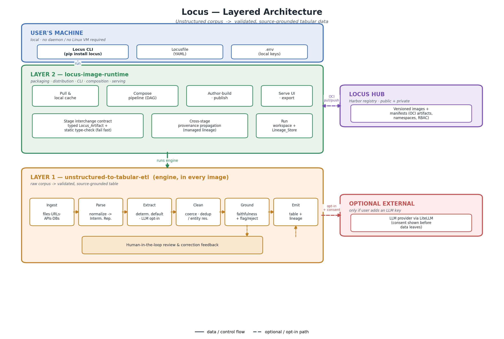

# Locus

Turn any unstructured corpus into validated, **source-grounded** tabular data — ready to feed an LLM.

Locus packages data operations as reusable, versioned **images**. You pull an image, point it at your own data, run it locally, and get a clean table where **every cell carries its source location and a faithfulness score**. Images compose into pipelines, and you can publish your own to Locus Hub (public or private).

## Architecture (layered)

The diagram is generated from [`docs/generate_architecture_diagram.py`](docs/generate_architecture_diagram.py) (PNG + SVG in `docs/`).

### Layer summary

| Layer | Spec | Responsibility |
|-------|------|----------------|
| **Layer 1 — Engine** | `unstructured-to-tabular-etl` | Raw corpus -> validated, source-grounded table. Connectors, parsing, extraction, cleaning, the cell-level grounding/faithfulness contract, review. Embedded inside every image. |
| **Layer 2 — Runtime** | `locus-image-runtime` | Packaging, CLI, Locusfile, image pull, multi-image composition (DAG), typed stage interchange, cross-stage provenance, serve/export, and publishing to Locus Hub. |

## Key properties

- **Local-first.** Default runtime is a plain Python process — no daemon, no Linux VM. Docker is an optional backend.
- **Privacy is explicit.** Deterministic engine keeps data local; the LLM engine activates only when you add a key, with a consent notice before any data leaves.
- **Trust travels with the data.** Provenance and faithfulness survive every pipeline stage, from extraction through merge and redaction.

## Documentation

Detailed design lives in the spec documents:

- Layer 1 engine — [`.kiro/specs/unstructured-to-tabular-etl/requirements.md`](.kiro/specs/unstructured-to-tabular-etl/requirements.md)
- Layer 2 runtime — [`.kiro/specs/locus-image-runtime/requirements.md`](.kiro/specs/locus-image-runtime/requirements.md)
- Image catalog (planned images + build order) — [`.kiro/specs/locus-image-runtime/image-catalog.md`](.kiro/specs/locus-image-runtime/image-catalog.md)
- Architecture & decision log — [`.kiro/specs/unstructured-to-tabular-etl/architecture-notes.md`](.kiro/specs/unstructured-to-tabular-etl/architecture-notes.md)

## Status

Early design. Requirements are defined for both layers; implementation has not started.

## Contributing

See [CONTRIBUTING.md](CONTRIBUTING.md).

## License

[MIT](LICENSE) © 2026 Dibae101
